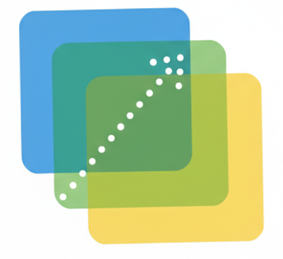

<div align="center">
    
    <h1 align="center">DecViz</h1>
</div>

# Overview
DecViz is a free, open-source web application that transforms domain knowledge into interactive graph visualizations through declarative programming.

# Getting Started

## Prerequisites
- Node.js (v16+)
- Python 3.11+
- Logica

## Installation

1. Clone and setup:
```bash
git clone https://github.com/yilinxia/DecViz.git
cd DecViz
conda env create -f environment.yml
conda activate decviz
npm install
```

2. Start backend server (Python FastAPI):
```bash
pip install -r requirements.txt
uvicorn api.logica_backend:app --reload --port 8000
```

3. Start frontend development server:
```bash
NEXT_PUBLIC_LOGICA_BACKEND_URL=http://localhost:8000 npm run dev
```

> Note: You can use `./start.sh` to start both backend and frontend in development mode.

## Docker Development

For easier development with Docker:

1. **Development with Docker Compose:**
```bash
# Start both frontend and backend in development mode
npm run docker:dev
```

2. **Production build with Docker:**
```bash
# Build and run production container
npm run docker:build
npm run docker:run
```

## DigitalOcean Deployment

### Prerequisites
- DigitalOcean account
- `doctl` CLI installed ([Installation Guide](https://docs.digitalocean.com/reference/doctl/how-to/install/))

### Quick Deployment

1. **Authenticate with DigitalOcean:**
```bash
doctl auth init
```

2. **Deploy using the automated script:**
```bash
./deploy.sh
```

### Manual Deployment

1. **Build and test locally:**
```bash
docker build -t decviz .
docker run -p 3000:3000 -p 8000:8000 decviz
```

2. **Deploy to DigitalOcean App Platform:**
```bash
doctl apps create --spec .do/app.yaml
```

3. **Update deployment:**
```bash
doctl apps update <app-id> --spec .do/app.yaml
```

### Environment Configuration

Copy the example environment files and customize as needed:
```bash
cp env.development.example .env.development
cp env.production.example .env.production
```

## How It Works

DecViz uses a two-language approach:
1. **Domain Language**: Define facts and relationships using Logica
2. **Visual Language**: Configure visualization using Logica predicates

Example:
```logica
# Domain Language
Argument("a"); Argument("b");
Attacks("a", "b");

# Visual Language  
Node(node_id: x, label: x, shape: "circle") :- Argument(x);
Edge(source_id: source, target_id: target) :- Attacks(source, target);
```

# License 
The software is available under [Apache 2.0 License](https://github.com/yilinxia/DecViz/blob/main/LICENSE).

# Contact
For any queries, please [open an issue](https://github.com/yilinxia/DecViz/issues) on GitHub or contact [Yilin Xia](https://github.com/yilinxia).